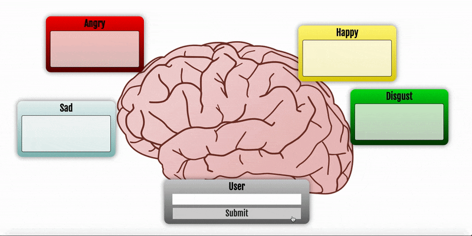

# iochatbot
A chatbot with four different emotionally biased responses (happy, sad, angry, disgusted) based on the inside-out movie.

## Approach
The iochatbot uses two primary strategies to produce responses.

1. Templating and Dynamic Corpus Generation
  - The entire Friend's TV series script corpus was used as a conversational dataset for templating.
  - When a user types a sentence, the main subject is identified and this corpus is searched for a sentence with a similar subject. If no similar sentence is found, a random sentence is chosen from the dataset.
  - This template sentence then has each word in it broken down to be annotated with its Part of Speech (POS) tag.
  - A set of weights are used to probabilistically determine whether or not to replace each POS tagged word with a correspondingly tagged word from an emotional dataset of words associated with each emotion.
  - This process is then repeated to generate 100 lines of uniquely generated sentence responses.

2. Bag of Words Selection
  - A bag of words model inputs the dataset generated by the templating step.
  - The model then uses a cosine similarities approach to determine which generated sentence best fits the prompt
  - This chosen sentence is then outputted to the environment and displayed on the Python Flask GUI.
